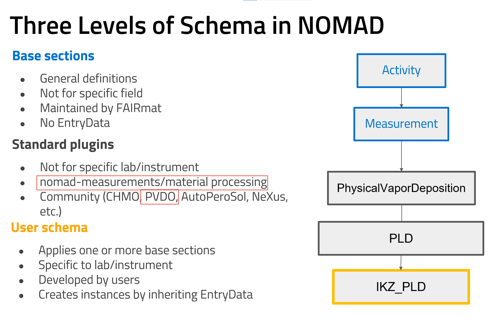

# Levels of Schema

It is important to understand the structure and relationship of different types of schemas in NOMAD. Here we break down the levels of schemas and how they interact. For detailed information, please visit the [official NOMAD documentation](https://nomad-lab.eu/prod/v1/staging/docs/explanation/data.html#schema).

## Types of Schemas in NOMAD
  
NOMAD categorizes its schemas into multiple levels, each serving distinct purposes while ensuring consistent data organization and interoperability:  
  
1. **Basic Architecture Sections**: These define the overall structure of any entry within NOMAD, regardless of the specific data type. They provide a shared, high-level framework applicable across different use cases, ensuring that every entry adheres to a consistent format. `EntryData` and `ArchiveSection` are the two relevant classes to be mentioned here.
Every entry in NOMAD must inherit from `EntryData`, whenever a class is only used as a subsection composed within a more general one, inheriting from `ArchiveSection` is enough.

2. **Base Sections**: These are central to NOMAD's data model and are designed to maintain interoperability between different database entries. The base sections follow an entity-activity model tailored for materials science, capturing essential relationships between key entities like samples, instruments, processes, measurements, analyses, experiments, and simulations. The goal is to provide standardized structures for data representation.

	!!! Note
        Base sections in NOMAD are abstract and should not be instantiated directly. Instead, users must implement these sections in their own schemas (referred to as user schemas) by inheriting from a base section and `nomad.datamodel.EntryData`. Users are strongly encouraged to use the most specialized section available for their use case.

3. **User Schemas**: These schemas are developed by users and are specific to a lab, method, or instrument. They build upon the base sections, tailoring them to meet specific research needs. In this level, users can define more specialized structures that directly reflect the specific characteristics of their experiments or simulations.
  
4. **Community/Standard Plugins**: FAIRmat offers standardized schemas for common methods, processes, and instruments that are generalized and not tied to any specific lab or setup. These schemas are derived from recurring patterns identified across user schemas. Users can inherit from these standard plugins in a similar manner as the base sections, further specializing them as needed while still maintaining a consistent structure for broader community use. 
FAIRmat's Area A for synthesis data provides two community plugins, NOMAD Measurements and NOMAD Materials Processing.

## How These Schemas Relate to Each Other
  
The relationships between these schema levels can be visualized as a layered model:  

- **Base Sections**: At the core, ensuring interoperability and defining the primary structures.

- **Community/Standard Plugins**: Inherit and specialize the base sections and provide generalized versions of common user schemas, making them broadly applicable across the community while still allowing further specialization.

- **User Schemas**: Inherit and specialize a Community/Standard Plugins, if available, or the base sections according to specific requirements.

## Encouraged Usage
  
NOMAD encourages users to first explore the available community/standard plugins and base sections before developing their own schemas. By doing so, they can maximize interoperability and benefit from established structures, while still retaining the flexibility to adapt the schema to their unique needs.  
  
In summary, the schema architecture in NOMAD is designed to support both specialized research needs and broader community use through a structured, layered approach that balances standardization with flexibility.  
  
The figure below illustrates these schema levels and the recommended workflow for schema development within NOMAD.  

In next documentation sections, an overview of the available methods will be provided.

