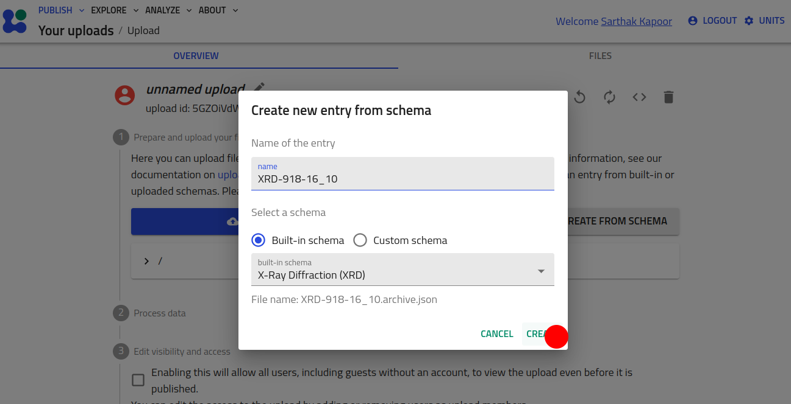
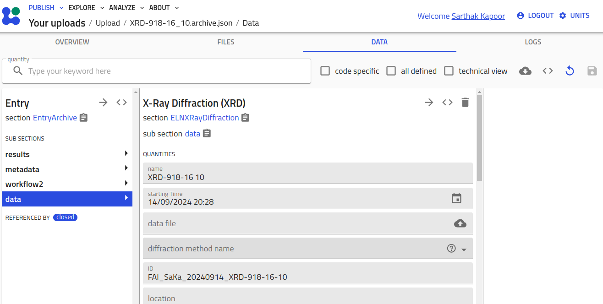
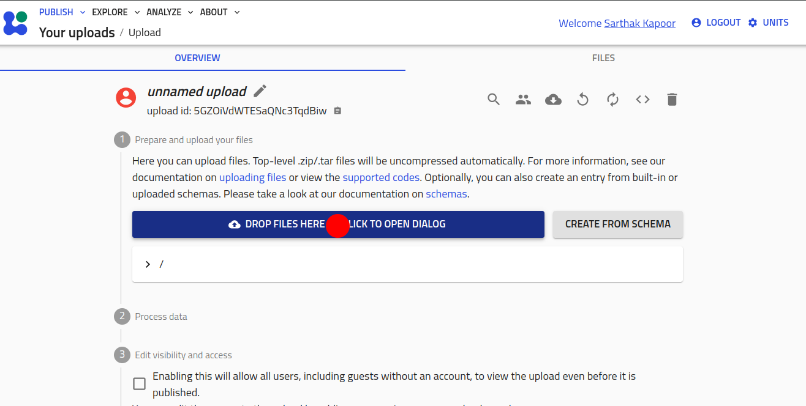
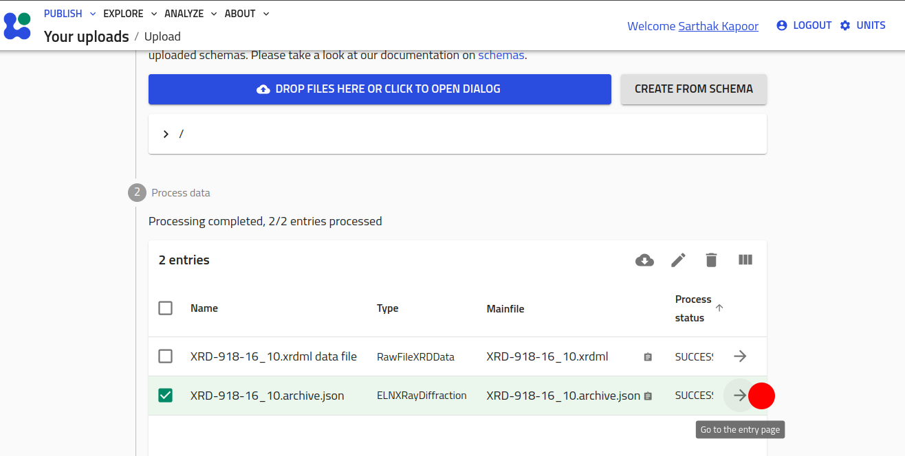

# How to Use the NOMAD-measurement Plugin

The **NOMAD-measurement plugin** provides standardized schemas for common characterization methods and instruments. These schemas are generalized to ensure they are not tied to any specific lab or setup, promoting interoperability across the materials science community. Users can inherit from these schemas, further specializing them to fit their specific needs, all while maintaining a consistent structure that benefits broader community use. For more details, see [levels of schemas in NOMAD](../explanation/levelsofschema.md).

To use this plugin, you must have it installed on your NOMAD Oasis instance (please refer to the [installation guide](install.md) for instructions). Alternatively, you can explore the plugin’s functionality and make use of it on our centrally hosted [Example Oasis](https://nomad-lab.eu/prod/v1/oasis/gui/search/entries).

This guide will walk you through the different ways to use the NOMAD-measurement plugin:

- **Without specialization**: Instantiating NOMAD entries directly from the "*built-in schemas*".
- **Inheriting and specializing**: Using custom YAML schemas to adapt the existing schemas for your specific use case.
- **Using Python schema plugins**: Inheriting and specializing schemas with Python for advanced customization.

## Using "Built-in Schemas"

In this section, we will demonstrate how to use the standard, built-in **entry** schemas
provided by the plugin without any specialization. These schemas can be directly
instantiated to create entries in a NOMAD Oasis.

1. Start a new upload and click on the **CREATE FROM SCHEMA** button.
2. Select the schema from the drop-down menu, add the name for the entry, and
hit **CREATE**.

    

    

The user can also simply drop their measurement files into the Upload folder. The plugin
comes with matching parsers that can automatically parse specific file types, create
corresponding measurement entry section and populate it. Let's see an example for 
XRD measurement file of file type `.xrdml` coming from Panalytical X-ray Diffractometer. 
You can also 
[download this file](../assets/XRD-918-16_10.xrdml)
and perform the following steps.

!!! info
    Supported measurements and file types can be found 
    [here](../index.md#supported-measurement-techniques).

1. Start a new upload.
2. Click on **DROP FILES HERE** button and select the XRD file. Or simply drag and drop
the file on the button.

    

3. An entry using `ELNXRayDiffraction` section is automatically created and populated
based on the data from the measurement file. Open it by clicking on the right arrow.

    

## Inheriting and Specializing Using Custom YAML Schemas

Here, we will guide you through how to extend and specialize the built-in schemas using custom YAML schemas. This approach allows you to tailor the schema to your specific requirements while still leveraging the standardized base provided by the plugin.

Let's assume that you want to extend the [`XRDResult`](../explanation/schemas.md#xrdresult)
section and include the position where the X-ray impinges the sample. For this, you
want to add two array quantities *x_position* and *y_position*. Based on this new
result section, let's call it `MyXRDResult`, you want to create modified entry section
`MyELNXRayDiffraction`. You can write a YAML schema to define these custom section.
Here's an example code:

```yaml
definitions:
  name: 'XRayDiffraction customization'
  sections:
    MyXRDResult:
      base_sections:
        - nomad_measurements.xrd.schema.XRDResult
      quantities:
        x_position:
          type: np.float64
          shape: ['*']
          unit: meter
          description: "x-coordinate of the point of X-ray incidence in sample holder coordinate system."
        y_position:
          type: np.float64
          shape: ['*']
          unit: meter
          description: "y-coordinate of the point of X-ray incidence in sample holder coordinate system."
    MyELNXRayDiffraction:
      base_sections:
        - nomad_measurements.xrd.schema.ELNXRayDiffraction
        - nomad.datamodel.data.EntryData
      sub_sections:
        results:
          repeats: True
          section: '#/MyXRDResult'
```
Save the file as `<file_name>.archive.yaml` (or download it from 
[here](../assets/custom_schema.archive.yaml)
) and add it in your
upload folder to access the custom schemas.

You can learn in detail how to create your own YAML schemas in our previous 
[tutorial 8](https://youtu.be/5VXGZNlz9rc?feature=shared) and 
[tutorial 13](https://github.com/FAIRmat-NFDI/AreaA-Examples/tree/main/tutorial13/part2#22a-yaml-schema).
You can navigate in the 
[tutorial 8 repository](https://github.com/FAIRmat-NFDI/AreaA-Examples/tree/main/tutorial8) 
to see some other examples of YAML files that inherit and extend existing classes.

## Inheriting and Specializing Using Python Schema Plugins

For users needing more advanced customization, we will show you how to inherit and specialize schemas using Python schema plugins. This method allows for dynamic, programmatic extensions of the standard schemas to accommodate complex use cases.

By following these steps, you can seamlessly integrate the NOMAD-measurement plugin into your workflows and adapt it to meet your specific needs.